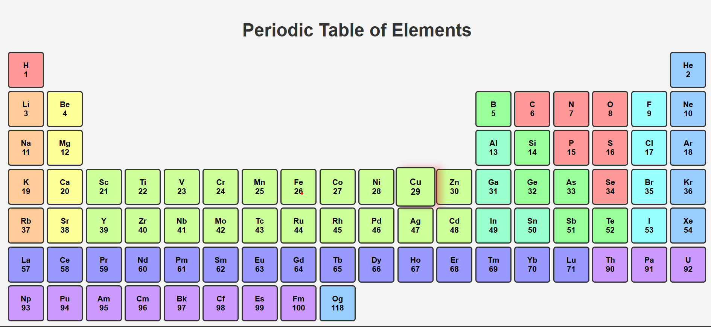

# Periodic Table
This is a simple Periodic Table web page built using HTML and CSS. 
It visually represents all the elements of the periodic table in an easy-to-read format.

## Technologies Used
- HTML
- CSS

## Features
Complete periodic table with element symbols and atomic numbers
UI using HTML & CSS

## Screenshot

## How to Use
Download or clone this repository.
Open the `Periodic.html` file in  web browser.

## Author
- **Deepanshu Pal** - [GitHub Profile](https://github.com/deepanshupal8601)

## Contributing
Pull requests are welcome. For major changes, please open an issue first to discuss what you would like to change.

